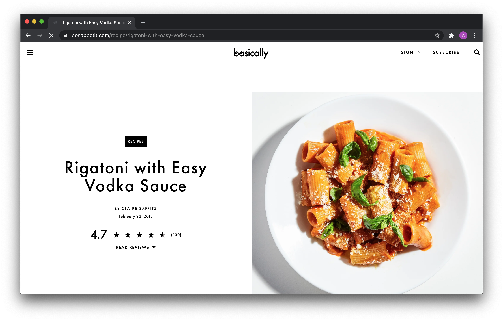
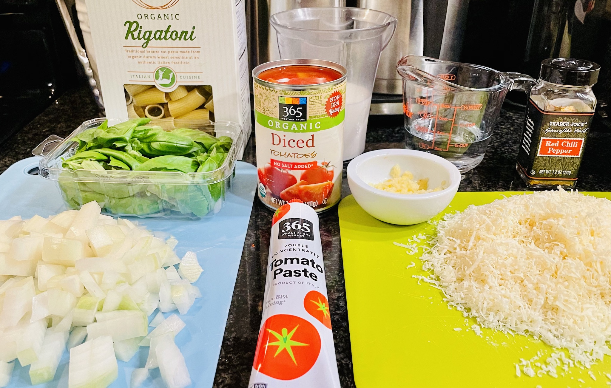
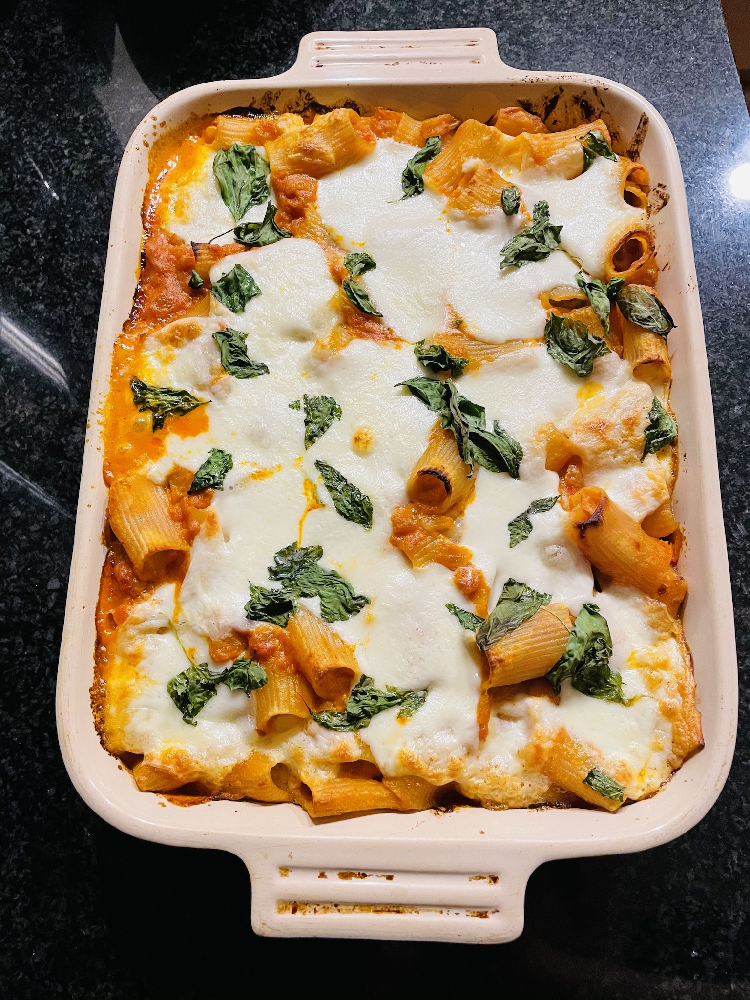

<ul class="recipe-meta">
    <li>Prep time: 20 min</li>
    <li>Cook time: 45 min</li>
</ul>

If I had to choose a last meal, this would be in the top five for sure. It's my go-to dish when I visit family or perfect for a quiet, holiday meal at home.

All the credit for this dish goes to Claire Saffitz and Molly Baz ([YouTube](https://www.youtube.com/watch?v=DrzWGUGN6vY), [Bon Appetit](https://www.bonappetit.com/recipe/rigatoni-with-easy-vodka-sauce)).

The ingredient list is short, and it will teach you how to make vodka sauce (yes there is actually vodka in there). You'll be surprised how far tomato paste goes in this recipe, and how creamy and delicous the sauce will be.

I'm jealous that you're getting ready to cook this tonight.

### Ingredients

- 1 medium onion
- 6 garlic cloves
- 8 oz. Parmesan cheese
- 2 Tbsp. extra-virgin olive oil
- 1 4.5-oz. tube double-concentrated tomato paste
- 1/2 tsp. crushed red pepper flakes
- 2 oz. vodka
- 3/4 cup heavy cream or half & half
- 1 lb. rigatoni
- Basil leaves

### Instructions

To prepare: dice the onion small, press or mince the garlic, and shred some fresh parm. I like to pour the vodka in a small glass and prepare a measuring cup (for the cream, for later).

Fill a big stockpot with water and dump a handful of salt in there. Add a little more than you think you're supposed to add.

Once the water is started, put a dutch oven or large skillet over medium high heat and add the oil.

Sauté the onions for about 10 minutes until translucent. Add the garlic and sautee for a few more minutes. At this point you can season with salt & pepper. Once the onions and garlic start to brown a little bit, move on to the next step.

<em>If you want it to be super tomato-y, you can add a small can of diced tomatoes now. I have made this with and without the extra tomatoes and I slighly prefer the extra tomato flavor. That being said, I don't include the extra tomatos in the ingredient list because this dish is still perfect without them.</em>

Now squirt all the tomato paste into the pan and stir it around for 5-10 minutes until combined. The goal is to dry it out and super-camalized the onions and tomatoes until it's sweet.

You wanna cook down & reduce the paste until it's almost brown. It will look ugly but that's okay.

Add the vodka to deglaze and keep stiring for a few minutes; it will evaporate pretty quickly. I prefer Tito's or Chopin potato vodka. Be sure to taste the vodka while you're cooking for a more immersive experience.

By now, the water should be close to boiling. Grab that measuring cup and scoop out ¼ of the hot water. Pour the 3/4 cup cream over the hot water to warm it up a bit (this will prevent the cream from breaking apart when you mix it in with the tomato jam).

At this point, you will want to turn down the heat to medium low or low and slowly add the diluted cream mixture. Add a little at a time, then stir. If you get the end of your cream and want it creamier, add more (we're not going for healthy here).

Drop the pasta in the boiling water and continue to slowly cook the sauce for about 10 min. It will thicken and smell really good.

Cook the pasta al dente (because it's gonna cook a little more in the sauce). Two minutes before it's supposed to be done, scoop out 1 cup of starchy pasta water and set aside. Drain the pasta or spider it straight into the sauce mixture.

Stir the pasta with the tomato mixture and add ¼ cup of water and a handful of parm at a time and watch it thicken up even more. You can go overboard on the parm.

At this point you're drooling and ready to eat. Plate or bowl the pasta and top with more parm and freshly torn basil (shoutout to <a href="https://www.gothamgreens.com/" target="_blank">Gotham Greens</a>).

If you want to jazz it up even more, you can bake it in a casarole with fresh ricotta & mozzarella (20 min at 375 degrees). If you do this, make the pasta even more al dente.

Hope you had fun making this and it tastes phenominal. Check back soon for more recipes!
