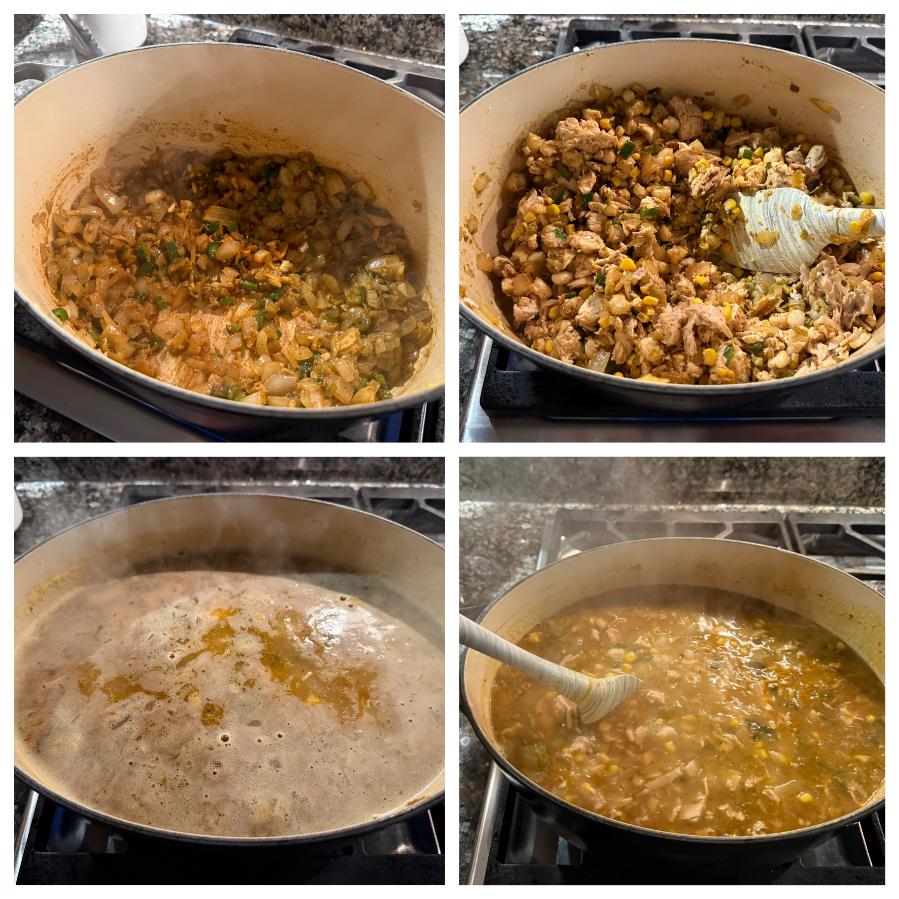
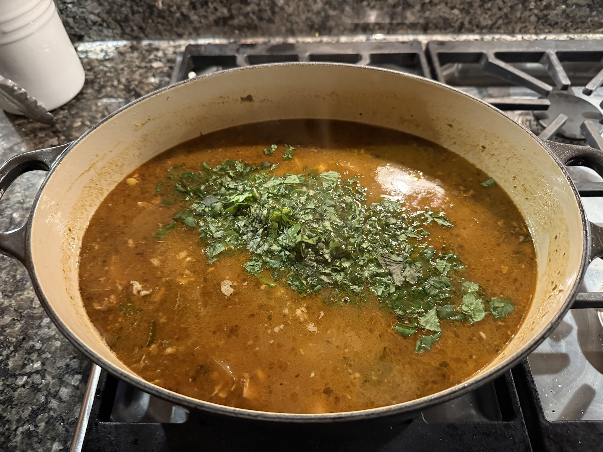

<ul class="recipe-meta">
    <li>Prep time: 30 min</li>
    <li>Cook time: 45 min</li>
</ul>

---

### Ingredients

- 2 tablespoons olive or avocado oil
- 1 tablespoon butter
- 1 large yellow onion, chopped
- 1 poblano or jalapeno pepper
- 8 cloves garlic, roughly chopped
- 1 15oz. can of sweet corn
- 1 25oz can of white hominy
- 2 tsp ground cumin
- 1 tsp ground corriander
- 1/2 tsp chili powder
- 1/2 tsp paprika
- 1 tsp dried oregano
- 1 tsp garlic powder
- 2 tsp kosher salt
- A few shakes of ground black papper
- ⅛ tsp cayenne (optional)
- 1 can mild green chiles
- 1 full rotisserie chicken, picked and chopped
- 64 oz. (8 cups) chicken stock
- 2 limes
- 1 bushel of fresh cilantro
- Shredded cheese, avocado slices, and chopped green onions for topping

### Instructions

Chop the onions, pepper, and garlic and set aside. Drain the hominy and corn. Mix the spices into a small bowl. Pick the chicken and chop the cilantro. Squeeze the limes into a small bowl.

Sauté the onions for 10 mintutes with butter and avocado oil. Add the garlic, green chiles, and pepper for another 5 minutes then add the spice mix and stir. Add the hominy and corn for 2 minutes then add the chicken for another 2 minutes. Stir constantly to incoprorate the spices.

Add the broth and bring to a boil before turning down to low for 30 minutes. Stir every 5 minutes and add salt to taste. Add the lime juice and 3/4 of the cilantro.

Serve immediately with sour cream, green onions, tortilla chips and/or garlic bread.
